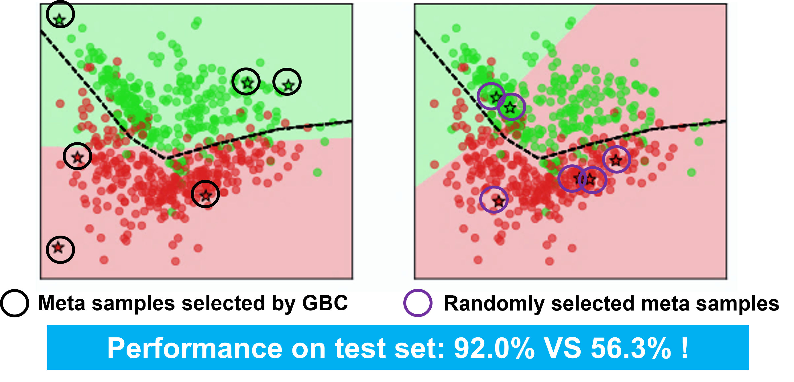

Code for the paper:
> Yinjun Wu, Adam Stein, Jacob Gardner, Mayur Naik, "Learning to Select Pivotal Samples for Meta Re-weighting " (AAAI 2023 oral)




# Install the pre-requiste:
```
pip install -r requirements.txt
```


# Minimal code block for using our algorithm for selecting meta samples for meta reweighting algorithm:
```

#select valid samples with rbc
valid_ids, new_valid_representations = get_representative_valid_ids_rbc(train_dataset, criterion, optimizer, trainloader, args, net, valid_count)


#select valid samples with gbc
valid_ids, new_valid_representations = get_representative_valid_ids_gbc(train_dataset, criterion, optimizer, trainloader, args, net, valid_count)


```

See the jupyter notebook [main_example.ipynb](main_example.ipynb) for details 


